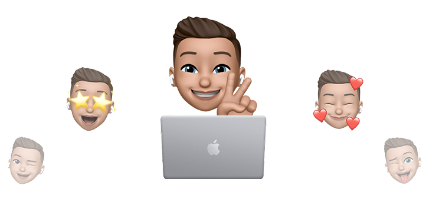

  

<h1 align="center">Hi there  I am Szymon</h1>

  

  
  
  

I am a front-end developer with almost 1 year of non-commercial experience. I love creating websites / web applications. I am ambitious, persistent and self-taught. I like challenges, I quickly adapt to new technologies and I pay attention to the small details. I learn every day to deep my knowledge.

- 🖥️ See my portfolio at [**szymondudka.xyz**](https://szymondudka.xyz/)
- ✉️ Mail: [**szymooneq@zohomail.eu**](mailto:sdudka8@gmail.com)
- 🧠 I'm currently learning app testing with **Jest** library.
- ⚽ I like traveling, web design, gaming, technologies, taking photos and football.

### Languages and Tools

![Sanity](https://img.shields.io/badge/Sanity-FFFFFF?style=for-the-badge&logo=data:image/png;base64,iVBORw0KGgoAAAANSUhEUgAAADAAAAAwCAYAAABXAvmHAAAACXBIWXMAAAsTAAALEwEAmpwYAAAGvUlEQVRo3u1aCVBVZRRmpmnV0kwlF1wQlUVQQRR3Kc0lGSvH1KbFdcbKamzUprFMx6UyTS2VStPUCEURVNxxBQl3cxsbx5oWssz37lt4273v8XXOufCAGUFZLsYM/8zPPN6993G+/2zfdx4Bln6d82jbaunOC6AfqM07oBBJbQVgqwNQB6AOQHUB6N8Flr5RULp3hNK5FZSIFjCHN9N3RHMoUUFQuoXA0idSv/d/A2BAVzFKISPZWEt8DGyjBsM+YRTsU8chf+p42CeOhm30MFiH9ILSpQ3MHZtCiQvVn72nAOKjoXRtC3PYk7C9/Byci+fDnfI91P0ZUI8cgJp1SN9HMqEe2A1PegpcXy2D/Z1J4g1zaKB4rQoeqSQA/oO0FTKAQ8a5aC7UnGPQTh6HmkmG7kqDZ0cq7a3FO2Mb1H07oR0/SvflwJ20DraXEmBu3xhKbAfyRnQNAiDXmzs0gXVwHNypP0A7c4IMJKPTNsOzfUv5m7zAW8s+Ai03C45Z0yg/Wun5UfGQqgQAChsxfkQ81ONkRPbh0oazgbu3Qz12EFrOUTlxCaO9O/RrRffxM3u2w3v+DJxLP4YS2RKWuLCKhlMlAPSgKhMdDO/PV6BdPA8PxbzfIAoT7cdjZNgOuFYugWPBLNnOLxbBszOVrmURuPRiwAyI3z93CvnTJlM4NTEYAH24qcXDcHw0A7w4Wd3J68UQlYxWsw7DsfBDvdpQcnMpVTq1kMpjGRgLx+zp4hl1X0YpEOqhfZInnAcSSoYBoHJpav2oVBhe2oWzcK1N1E+Rwil/5lS6/hgZTeHQp5P+DFcZLrPUG0yt6lNpHQ+V4t+zK12ek03Ga6dykT/9dSqxgcYBUGLbS/32/fm7AChQVX/ouFZ9LvWdQ+y2YcDv9QqHuW1DOJfMh/fSeaiH9/u399JPcK//RvdW704GAaCwsDzVDT6zCUWrgF6rRzNhHdQD5jYN6HpMuSEoIULhZJ/yit7sxhfuyWNhe/V5v8eMARDdTozw3fwHpZbPh/wZb8DU9D6Ymj2oAy2rQXHz695Bmp/kSOGW3zu39vcYY3KgZxjMlJTeKxdxu8XlMv/dKXKCZsoVU/OHpLIoMe0qcqrGllFT4ANwb1iN8pbv1k14qOs6ly4kijFCBxT8uA6obQPdQxU76eoDIIRtaG9UZPn+/ktKpevr5bC/+Zp0XA414ULcfWuUC1EMmwLvh+PTOajs8v17E+61q2Ad3lc+S4kMKj/5qxUAnxbnQstH4Fz+CTUDtdJA4PXClbhUyrM5pJFUuJohc+QF5i3cla1UEt1bklCV5buRBwuX4eCGFfVEFfSAJCGz0qYwBdWH7cWhcK1YLASvoESfuGsQeX9ACWtmMJUoS5FRzecurJfNxnKK9nEjReCwkCnq3HdazhWfyWfcO1HPXiEOJCot5AkJMaYOnDO2scMJ0Dxop3PLTomrl6FwlesZbiAA5inEaSy9Ikrs8LL5Cwt9lo+kIbjimNs1go2og3b5wm3K7Q26P1JvfIYAEAFPJ9ytvdCB4t1Rj10GUZ6q4msE9la9AFJzPeH79XopAAV2K6zPxOmErtoB8EmSkHHMngH35g0izrkx8XZvXCO6WIkJubOqYjlK+ZL/9kS/ACoGYBNgwomM8ACHAQPwXruqTx2IhcpmfXvuNOyTxlBFqlc2kSPj+XSZFPIhqJl74Pp2Jby//VIcQkwajQohpWswrMP6wMP6lrhOSR3Mxqj7d8E25lmd7zDLpNCSHKEkLsoDJneOee+LAOJn3UlrpVJJEl+/RmIoSPeiYVyI3O9c8AG0sydKi/ltm4TvsDhxzJkJ6wsDdS+wwOEkfzpWiB2HnigyCh/RxKnJMkvi5U7ZKBzJUE3MecDs0i/SS4JI2yQTCX6fPeJO/g6u1V/CvS5RDFWPHdKnGEWCXoAnQyMtzY1MtHQUeaBfF4PHKiQ+rAkDKJR2QjuRrQ+uSo5M+HVGmoSG5Ap7hoU861//fSkCnjs3e4RHj9IE42uCSjCFCG8unnAlLhNBLpOFwqHV3Qy3eKKhnT0J99YkOXkhc0XNsEY6MVeUKH0KLSWRJwu52Xr4HNwrYxaZPHCs89Rud7qMFiWMTubI7Mgx9z3KkVC9+1ZO4FSRSnBjoooh0wh6nf/WBJk4cGWRcKEQkzCi6sRTOA4Z15oVMk7kes9VSXpH5eai1cSFiga9hdNmmQlRH7Am9Idt1BDiQAlSWq0jB+lNiu/j8Xr1yEoDvqHhJhYXKtWKOyqrLflygxuY0I2Iuq+Y6gDUAagDUBpArf9nj1r97zb/AbgHA9gTqDakAAAAAElFTkSuQmCC)

### Projects
| Name | Description | Source | Deploy |
|:----:|:------------|:----:|:-----------:|
| Personal Portfolio | My own portfolio page. Responsive website without the use of any CSS framework. | [GitHub](https://github.com/szymooneq/Personal-Portfolio) | [Domain](https://szymondudka.xyz/) [Vercel](https://personal-portfolio-szymooneq.vercel.app/) |
| Tastebite Recipes App | Application with the ability to add and manage recipes. | [GitHub](https://github.com/szymooneq/Tastebite-Recipes-App) | [Vercel](https://tastebite-app-sd.vercel.app/) |
| Apple E-Commerce Store  | Modern Apple store created with React, TypeScript, Stripe payments and Strapi backend. | [GitHub](https://github.com/szymooneq/Apple-E-Commerce-Store) | [Vercel](https://apple-store-sd.vercel.app/) |
| Memory Master | Memory Master is a simple game where you have to match all images to win. | [GitHub](https://github.com/szymooneq/Memory-Master) | [Vercel](https://memory-master-sd.vercel.app/) |
| Hangman | Hangman is a simple game where you have to guess all the letters in a word. | [GitHub](https://github.com/szymooneq/Hangman) | [Vercel](https://hangman-sd.vercel.app/) |

  

